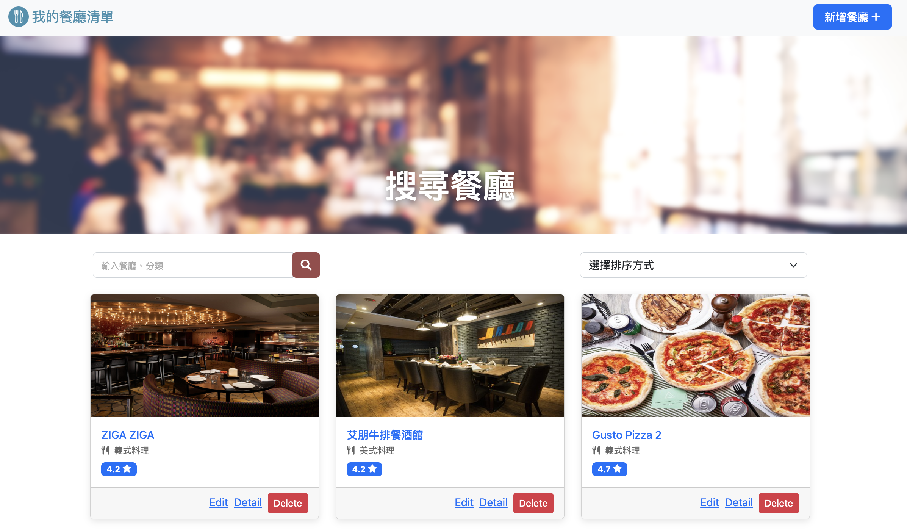

# A1 : 餐廳清單。Final  (AC 3 A1)


## Screenshot - 畫面截圖



## About - 介紹
這是一個用Express製作的餐廳清單網站。
使者可以登入自己的帳戶，自作自己的餐廳清單。

## Development Tools - 開發工具
* Node.js
* MongoDB
* nodemon
* bcryptjs": "^2.4.3",
* connect-flash": "^0.1.1",
* express": "^4.18.2",
* express-handlebars": "^4.0.3",
* express-session": "^1.17.3",
* method-override": "^3.0.0",
* mongoose": "^5.9.7",
* passport": "^0.6.0",
* passport-facebook": "^3.0.0",
* passport-local": "^1.0.0"

## Features - 功能

1. 使用者可以使用名稱或料理類型來搜尋餐廳
2. 使用者可以新增一家餐廳
3. 使用者可以瀏覽一家餐廳的詳細資訊
4. 使用者可以瀏覽全部所有餐廳
5. 使用者可以修改一家餐廳的資訊
6. 使用者可以刪除一家餐廳
7. 使用者可以依照不同方式排序餐廳
8. 使用者可以註冊帳號，登入，登出
9. 使用者可以用 Facebook Login

## Installation and execution - 安裝與執行步驟

1.開啟Terminal, Clone此專案至本機:
```
git clone https://github.com/klu0926/restaurant-oauth.git
```

2.進入存放此專案的資料夾
```
cd restaurant-oauth
```

3.安裝 npm 套件
```
npm install
```

4.安裝nodemon (如果已有可跳過)
```
npm install -g nodemon
```

5.使用MongoDB cloud 獲得你的 connection string
```
mongodb+srv://<username>:<password>@<cluster>.pk4dwnp.mongodb.net/?retryWrites=true&w=majority
```

6.在專案內創造一個.env檔案，並在其輸入你的 MongoDB connection string
```
MONGODB_URL=mongodb+srv://<username>:<password>@<cluster>.pk4dwnp.mongodb.net/<database name>?retryWrites=true&w=majority
```

7.製作種子資料 (這會做出8個基本資料，跟啟用新的資料庫)
```
npm run seed
```

8.啟動伺服器 (這會使用 nodemon 啟動專案)
```
npm run dev 
```

9.當 terminal 出現以下字樣，表示伺服器已啟動並成功連結
```
server live on http://localhost:3000
```

13.打開瀏覽器輸入以下網址來使用本專案
```
http://localhost:3000 
```

14.若欲暫停使用
```
ctrl + c
```

## NPM Scripts

* 種子資料，預設會產出2個使用者，跟6個餐廳到資料庫中
```
npm run seed
```

* 刪除全部在資料庫內的餐廳與使用者資料
```
npm run deleteAllData
```


